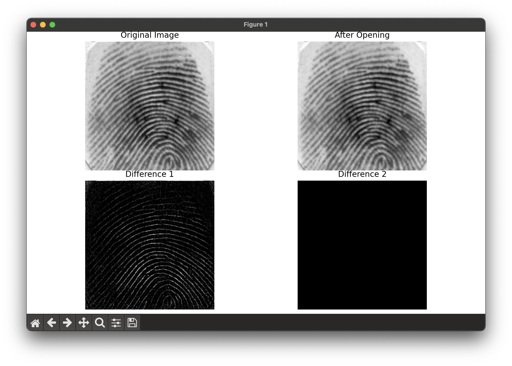

# Assignment 2 Computer Vision

## Description

This code repo holds the code and files for assignment 2 of computer vision

## How to run code

### Prerequisites

The following terminal commands work for Mac OS. Please try to find the same working commands for your OS of choice

1. Create python virtual env. If using native python: `python3 -m venv env`
2. Activate virtual env: `source env/bin/activate`
3. Install libraries: `python -m pip install -r requirements.txt`
4. Pre-process dataset running: `python pre_process_dataset.py`

### Image operations

1. Difference: `python morphological_image_processing/difference.py`

